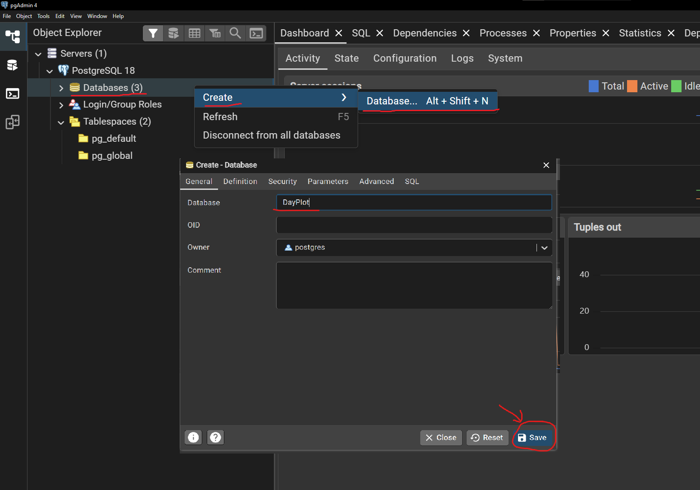

# Uruchomienie projektu DayPlot
__Wymagania:__
+ [_Git_](https://git-scm.com/install/)
+ [_Node.js_ + _npm_](https://nodejs.org/en/download) (idą rpytazem) 
+ [_Python 3_](https://www.python.org/downloads/)
+ [_PostgreSQL_](https://www.enterprisedb.com/downloads/postgres-postgresql-downloads) 
+ _Expo Go_ - aplikacja na iphone do szybkiego testu apki

__Dostępność pakietów przed lub po instalacji można sprawdzić w terminalu następująco:__
```bash
git --version
node --version
python3 --version
psql --version
# Jeżeli tych poleceniach jakaś
# wersja narzędzia zwraca error lub nic,
# najprawdopodobniej nie została dodana do ścieżki PATH.
# Ogarniemy to, napiszcie do mnie -->
```

## Klonowanie repozytorium z GitHub
Uruchom polecenie w ścieżce folderu, do którego chcesz sklonować projekt:
```bash
git clone https://github.com/virescentt/DayPlot.git
cd DayPlot
```

## Pobieranie zależności projektu
### 1. Backend (Flask + PostgreSQL)
Utwórz bazę danych PostgreSQL o tej samej nazwie co w projekcie (__DayPlot__). Wchodzimy do __pgAdmin4__: _databases -> new database -> wpisujemy DayPlot_. Potem __Save__.
 

<!-- (Opcjonalnie) zaimportuj dump bazy, jeśli jest dostępny -->
#### Co dotyczy Pythona:
+ Najpierw te polecenia:
```bash
python -m venv venv # utworzenie wirtualnego środowiska venv

# aktywacja venv
source venv/bin/activate # <-- dla MacOS
source venv/Scripts/activate # <-- dla Windows

pip install -r requirements.txt # instalacja zależności
```
+ Następnie w folderze `/backend` zmień nazwę pliku `.example.env` na `.env` i w linii *DB_URI* wstaw swoje dane w miejscach *YOUR_PASSWORD* oraz *DATABASE_NAME*.

+ Potem uruchomiamy plik `seed.py`:
```bash
# składa tabele w bazie i uzupełnia ich danymi.
python -m backend.db.seed
```

### 2. Fronted
Wykonać to:
```bash
cd ../mobile
npm install # instalacja zależności
```

## Przydatne polecenia do uruchomienia projektu
Uruchamia serwer Flask, który będzie obsługiwał żądania aplikacji:
```cmd
python -m backend.app
```
Podczas działania serwera aplikacja może uzyskać do niego dostęp w celu pobrania danych.

__do tej pory nie jest niezbędne.__

---

## Ostateczne uruchomienie apki :)
To własnie żeby zobaczyć wizualny wynik i poklikać sobie.
```bash
cd mobile/
npm start # 🟢
# Otworzy się Expo Dev Tools
# Teraz można zeskanować QR-cod i w aplikacji
# Expo Go zobaczyć naszą apkę

npm run web       # wersja web aplikacji
```


---

### something 
Android / iOS / web — różne sposoby przetestowania interfejsu aplikacji.

