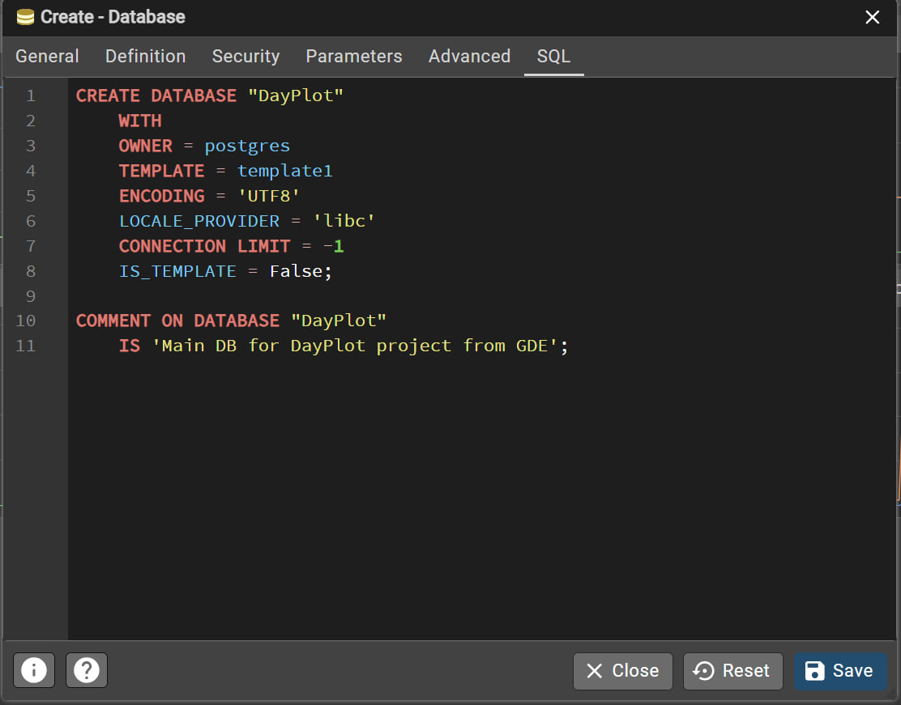

# Uruchomienie projektu DayPlot na Mac
__Wymagania:__
+ _Git_
+ _Node.js_ + _npm_ (idą razem) 
+ _Python 3_
+ _PostgreSQL_ 
+ _Expo Go_ na Iphone do szybkiego testu aplikacji mobilnej

Dostępność pakietów przed lub po instalacji można sprawdzić w terminalu następująco:
```cmd
git --version
node --version
python3 --version
psql --version
<!-- Jeżeli po pobraniu polecenia jakaś wersja narzędzia nie zwraca odpowiedzi,
najprawdopodobniej nie została dodana do ścieżki PATH. -->
```

## Klonowanie repozytorium z GitHub
Uruchom polecenie w ścieżce folderu, do którego chcemy sklonować projekt:
```bash
git clone https://github.com/virescentt/DayPlot.git
cd DayPlot
```

## Pobieranie zależności projektu
### Backend (Flask + PostgreSQL)

Utwórz bazę danych PostgreSQL o tej samej nazwie co w projekcie (__DayPlot__). Można to zrobić przez SQL Shell (psql) poleceniami lub przez interfejs graficzny pgAdmin: _databases -> new database -> DayPlot, gdzie template to template 1_. Pozostałe i tak będzie jako default ustawione.
 
Potem __Save__.

<!-- (Opcjonalnie) zaimportuj dump bazy, jeśli jest dostępny -->
Co dotyczy Pythona:
```cmd
python -m venv venv           # utworzenie wirtualnego środowiska
source venv/bin/activate      # aktywacja venv
pip install -r requirements.txt # instalacja zależności
```
Następnie w folderze `/backend` zmień nazwę pliku `.example.env` na `.env` i w linii *DB_URI* wstaw swoje dane w miejscach *YOUR_PASSWORD* oraz *DATABASE_NAME*.

Przed rozpoczęciem musimy również uzupełnić danymi i złożyć tabele w bazie danych. Dla tego uruchomiamy plik `seed.py`
```cmd
python -m backend.db.seed
```

### Fronted
```cmd
cd ../mobile
npm install # instalacja zależności
```

## Przydatne polecenia do uruchomienia projektu
Uruchamia serwer Flask, który będzie obsługiwał żądania aplikacji:
```cmd
python -m backend.app
```
Podczas działania serwera aplikacja mobilna może uzyskać do niego dostęp w celu pobrania danych.

---
```cmd
cd mobile/
npm start # 🟢
Otworzy się Expo Dev Tools
Uruchamianie na telefonie przez Expo Go z QR-codem lub w emulatorze iOS/Android

npm run android   # aplikację mobilną na Androidzie
npm run ios       # aplikację mobilną na iOS (tylko na Mac)
npm run web       # wersję web aplikacji w przeglądarce
```
`npm run …` → polecenia zdefiniowane w pliku `package.json` projektu


Android / iOS / web — różne sposoby przetestowania interfejsu aplikacji.

